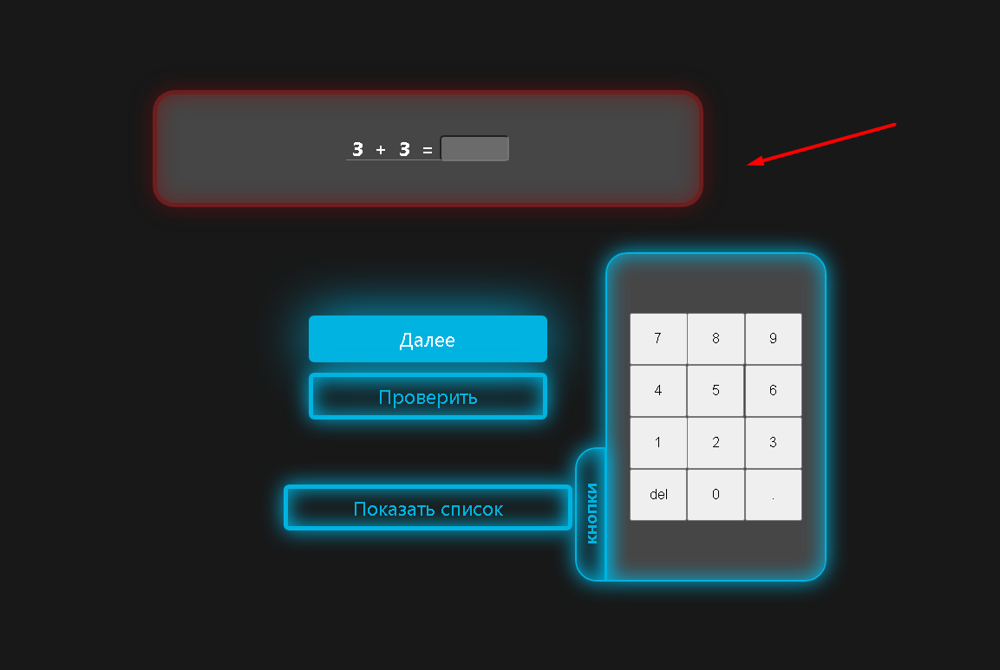

# Arithmetic-Animate

## GH-PAGES LINK: https://yaroslavborshevsky812.github.io/Arithmetic-Animate/

## QUICK START

```
    npm i
    npm run start
```


## DESCRIPTION
1. Choose the type and number of examples you want to solve 

2. Solve examples. You can use the auxiliary buttons

3. If the answer is correct the backlight is green

4. If you are failed the backlight is red

5. In the end you can see the result

